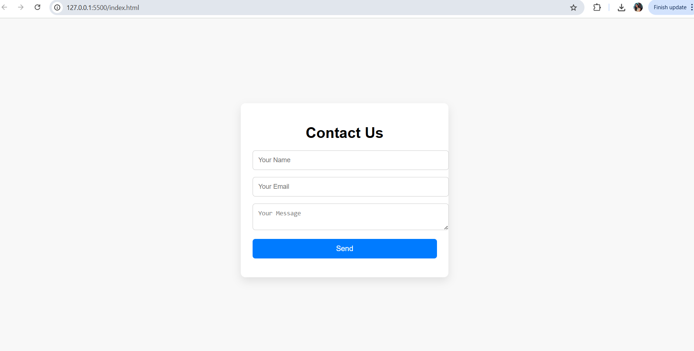

# Contact Form Project

This is a simple and responsive **Contact Form** created using **HTML, CSS, and JavaScript**.

## ✨ Features

- Name, Email, and Message input fields
- Input validation using JavaScript
- Feedback messages for success or errors
- Clean, minimal design using custom CSS
## Screenshot

## 📁 Files Included

- `index.html` – Main HTML file containing the form
- `style.css` – Styles for the form layout and responsiveness
- `script.js` – JavaScript for input validation and feedback

## 💡 How to Use

1. Clone or download the repo
2. Open `index.html` in your browser
3. Fill in the form fields
4. Submit and see real-time validation messages

## 📌 Note

This form does not send actual emails. It only simulates submission and validation for demo purposes.

---

> Project by Wanshita Singh – Intern, Skillbit Technologies
